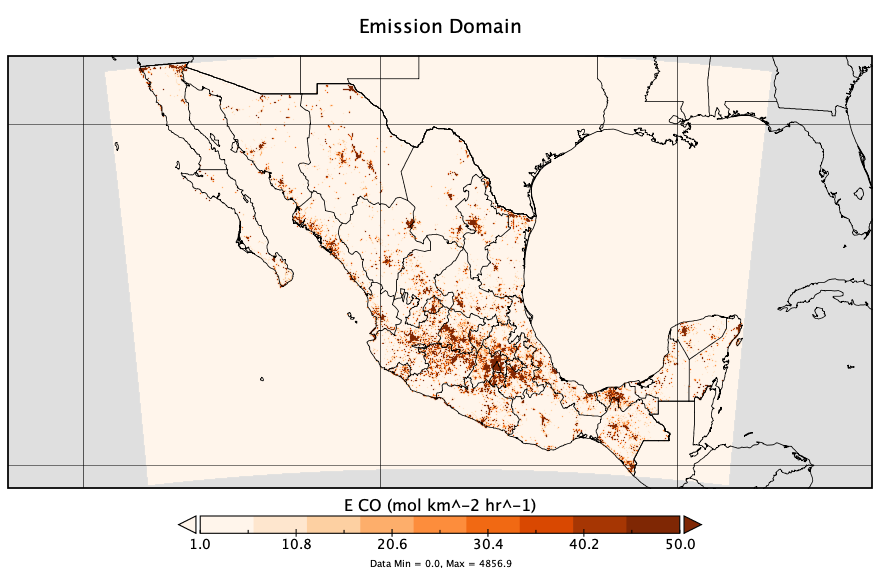
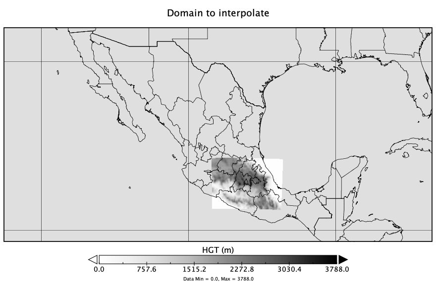
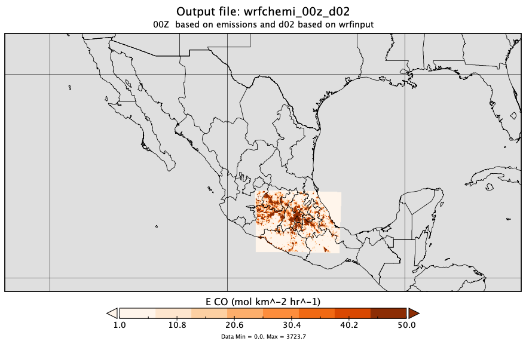
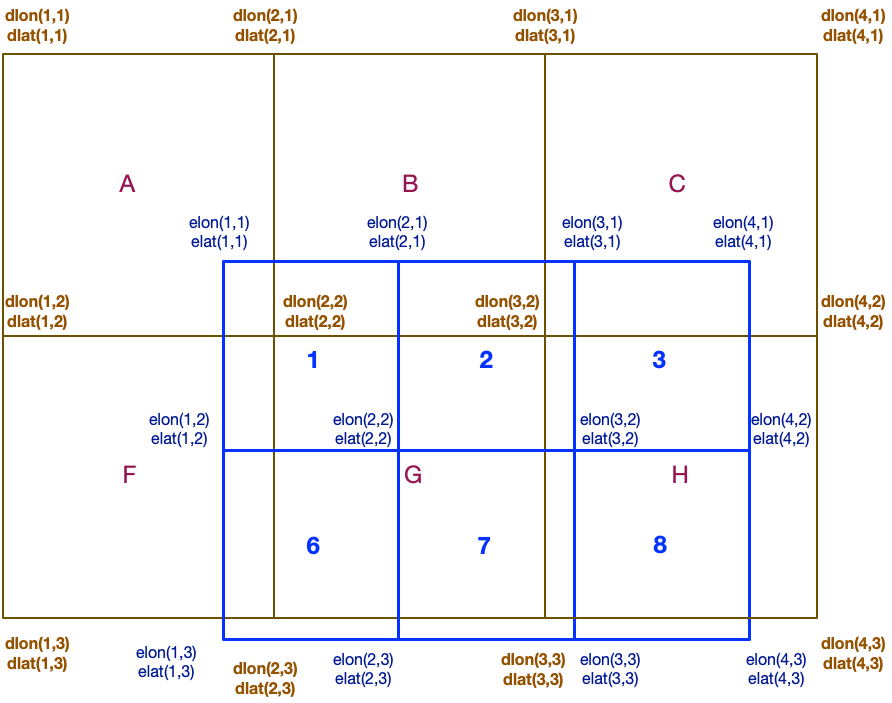
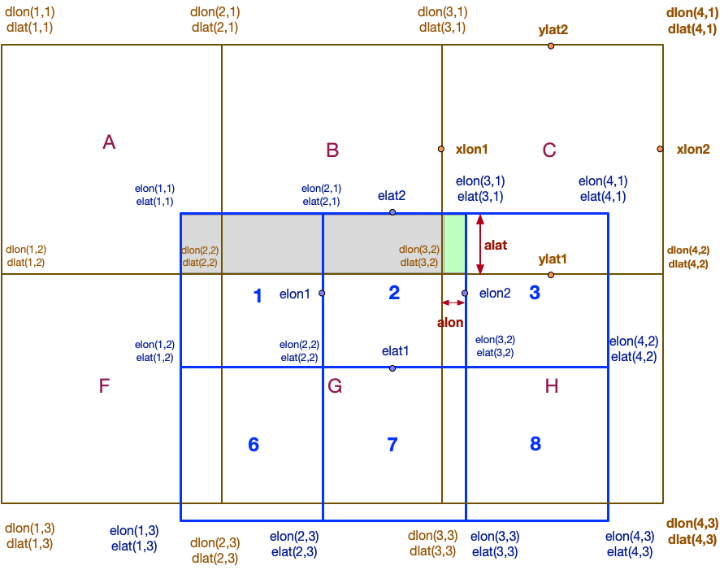

# interpola — Emission Interpolation to a New Grid

[](https://github.com/JoseAgustin/interpola)
[]()
[](https://github.com/JoseAgustin/interpola/releases/tag/v3.1)
[]()

> Regrid WRF-Chem emission files to a new model domain using a **mass-conservative flux interpolation** method. The target grid is defined by a `wrfinput` (or `geo_em`) file; the source emissions are read from a `wrfchemin` NetCDF file.

---

## Table of Contents

- [Overview](#overview)
- [Requirements](#requirements)
- [Installation](#installation)
- [Repository Structure](#repository-structure)
- [Input Files](#input-files)
- [Output Files](#output-files)
- [Usage](#usage)
- [Mass-Conservative Interpolation Method](#mass-conservative-interpolation-method)
  - [Grid Coordinate Convention](#grid-coordinate-convention)
  - [Overlap Area Calculation](#overlap-area-calculation)
  - [Emission Assignment](#emission-assignment)
- [Example](#example)
- [Releases](#releases)

---

## Overview

Emission inventories are produced on grids (global, regional, or local) that rarely match the exact resolution and extent of an air quality model domain. Because emissions represent a **flux** (mass per unit area per unit time), a simple nearest-neighbor or bilinear approach can introduce mass errors. `interpola` solves this by computing the fractional overlap between each source cell and each target cell, ensuring that the total emitted mass is conserved after regridding.

The workflow is illustrated below:

| Source domain | Target domain | Result |
|---|---|---|
|  |  |  |

---

## Requirements

| Component | Notes |
|---|---|
| Fortran compiler | `gfortran` ≥ 6 or Intel `ifort` ≥ 17 |
| NetCDF-Fortran | Version 4+ with Fortran bindings |
| OpenMP | Optional; enables parallel processing (fixed in v3.1) |
| Autotools | `autoconf` and `automake` for the build system |
| Bash | Required to run the example shell scripts |

---

## Installation

```bash
# 1. Clone the repository
git clone https://github.com/JoseAgustin/interpola.git
cd interpola

# 2. Configure the build environment
./configure

# 3. Compile
make

# 4. Install executables (optional)
make install
```

> **Tip:** If the NetCDF libraries are installed in a non-standard path, pass the include and library directories explicitly:
> ```bash
> ./configure FCFLAGS="-I/path/to/netcdf/include" LDFLAGS="-L/path/to/netcdf/lib"
> ```

---

## Repository Structure

```
interpola/
├── src/                   # Fortran 90 source code
├── example/               # Example input files and run scripts
├── doc/                   # Technical documentation
├── assets/images/         # Figures used in this README
├── golfo.sh               # Example run script (Gulf of Mexico domain)
├── fuegos.csv             # Example fire emission data
├── README.md              # This file
└── .gitignore
```

---

## Input Files

Two NetCDF files must be present in the working directory:

### `wrfchemin.nc`

A standard WRF-Chem emission file covering **either** the 00–11 UTC or 12–23 UTC period. All emission variables must begin with the prefix `E_` (e.g., `E_CO`, `E_NO`, `E_SO2`).

### `wrfinput`

The target domain definition file. This can be:
- A standard `wrfinput` file produced by WPS/real.exe, **or**
- A `geo_em.d0?.nc` file renamed to `wrfinput`.

When a `geo_em` file is used as `wrfinput`, the output timestamps are taken from `wrfchemin.nc`.

---

## Output Files

The interpolated emission file is written to the working directory:

```
wrfchemi_00z_d01    # for a 00–11 UTC input
wrfchemi_12z_d01    # for a 12–23 UTC input
```

The domain nest level (`d01`, `d02`, …) and the date stamp are derived automatically from the `wrfinput` file. All `E_*` variables from the source file are interpolated and written to the output with the same units.

---

## Usage

1. Place `wrfchemin.nc` and `wrfinput` in the same working directory.
2. Run the interpolation executable:

```bash
./interpola
```

3. The output file (`wrfchemi_00z_d01` or `wrfchemi_12z_d01`) will appear in the same directory.

An example run script for a Gulf of Mexico domain is provided:

```bash
bash golfo.sh
```

Refer to the `example/` directory for sample input files and a step-by-step walkthrough.

---

## Mass-Conservative Interpolation Method

Emission inventories represent a **surface flux** (e.g., mol km⁻² hr⁻¹). When regridding, the total mass emitted by each source cell must be redistributed proportionally across all overlapping target cells. The method implemented in `interpola` computes the fractional geographic overlap between every pair of source and target cells.

### Grid Coordinate Convention

The following figure shows the staggered coordinate layout used by WRF for both the source (emissions) grid and the target (model) grid:



*Figure 1. Staggered coordinate locations for the modeling domain (d-prefix) and the emissions domain (e-prefix).*

For each target cell `(i, j)` and candidate source cell `(ii, jj)`, four boundary coordinates are defined:

| Variable | Target domain | Emissions domain | Grid type |
|---|---|---|---|
| South boundary latitude | `ylat1 = dlat(i, j)` | `elat1 = elat(ii, jj)` | Unstaggered |
| North boundary latitude | `ylat2 = dlat(i, j+1)` | `elat2 = elat(ii, jj+1)` | Staggered lat |
| West boundary longitude | `xlon1 = dlon(i, j)` | `elon1 = elon(ii, jj)` | Unstaggered |
| East boundary longitude | `xlon2 = dlon(i+1, j)` | `elon2 = elon(ii+1, jj)` | Staggered lon |

For `N` emission values along an axis there are `N+1` staggered coordinates.

### Overlap Area Calculation

The fractional overlap between a source cell and a target cell is determined by checking whether their latitude and longitude ranges intersect:

```fortran
! Latitude overlap
if (ylat1 .le. elat2 .and. ylat2 .ge. elat1) then
    alat = (min(ylat2, elat2) - max(ylat1, elat1)) / (elat2 - elat1)
end if

! Longitude overlap
if (xlon1 .le. elon2 .and. xlon2 .ge. elon1) then
    alon = (min(xlon2, elon2) - max(xlon1, elon1)) / (elon2 - elon1)
end if
```

The total overlap area used to weight the emission contribution is then:

```fortran
alat = min(ylat2, elat2) - max(ylat1, elat1)
alon = min(xlon2, elon2) - max(xlon1, elon1)
area = max(0., alat * alon)
```

### Emission Assignment

The animation below illustrates how emissions from source cells (numbered 1–9+) are distributed across target cells (lettered A–H+):



*Figure 2. Fractional emission assignment across overlapping source and target cells.*

The contributions for each target cell are:

| Target cell | Receives flux contributions from source cells |
|---|---|
| **A** | 1 (full fraction) |
| **B** | 1 and 2 |
| **C** | 2, 3, and 4 |
| **F** | 1 and 6 |
| **G** | 1, 2, 6, and 7 |
| **H** | 2, 3, 4, 7, 8, and 9 |

Each contribution is weighted by the fractional overlap area. The sum of all weights for any given source cell equals 1.0, guaranteeing **mass conservation** across the entire domain.

---

## Example

The repository includes `golfo.sh`, a ready-to-run script that regrids emissions to a Gulf of Mexico domain. To run it:

```bash
bash golfo.sh
```

See the `example/` directory for the expected directory layout and a description of the sample input files, including `fuegos.csv` (fire emission data).

---

## Releases

| Version | Description |
|---|---|
| [v3.1](https://github.com/JoseAgustin/interpola/releases/tag/v3.1) | OpenMP parallelisation bug fixed (latest) |
| v3.0 | Initial OpenMP support |

---

*README last updated: March 2026*
